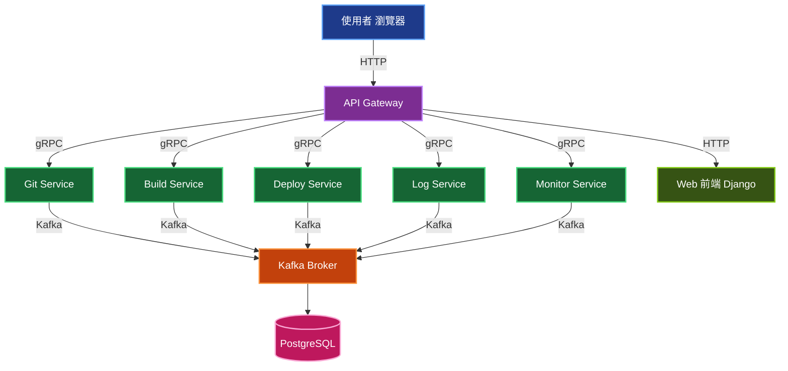

```mermaid
graph TD
    User[使用者 瀏覽器] -->|HTTP| API_Gateway[API Gateway]
    API_Gateway -->|gRPC| Git_Service[Git Service]
    API_Gateway -->|gRPC| Build_Service[Build Service]
    API_Gateway -->|gRPC| Deploy_Service[Deploy Service]
    API_Gateway -->|gRPC| Log_Service[Log Service]
    API_Gateway -->|gRPC| Monitor_Service[Monitor Service]
    
    Git_Service -->|Kafka| Kafka_Broker[Kafka Broker]
    Build_Service -->|Kafka| Kafka_Broker
    Deploy_Service -->|Kafka| Kafka_Broker
    Log_Service -->|Kafka| Kafka_Broker
    Monitor_Service -->|Kafka| Kafka_Broker
    
    API_Gateway -->|HTTP| Web_UI[Web 前端 Django]
    
    Kafka_Broker --> DB[(PostgreSQL)]
    
    %% 樣式設定
    classDef userClass fill:#1e3a8a,stroke:#60a5fa,stroke-width:2px,color:#ffffff
    classDef gatewayClass fill:#7c2d92,stroke:#c084fc,stroke-width:2px,color:#ffffff
    classDef serviceClass fill:#166534,stroke:#4ade80,stroke-width:2px,color:#ffffff
    classDef brokerClass fill:#c2410c,stroke:#fb923c,stroke-width:2px,color:#ffffff
    classDef dbClass fill:#be185d,stroke:#f9a8d4,stroke-width:2px,color:#ffffff
    classDef uiClass fill:#365314,stroke:#84cc16,stroke-width:2px,color:#ffffff
    
    class User userClass
    class API_Gateway gatewayClass
    class Git_Service,Build_Service,Deploy_Service,Log_Service,Monitor_Service serviceClass
    class Kafka_Broker brokerClass
    class DB dbClass
    class Web_UI uiClass
```